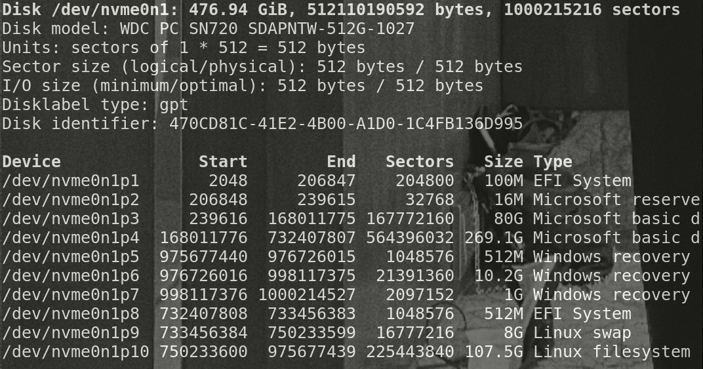

# Arch Linux

## 安装

### 验证启动方式

```
ls /sys/firmware/efi/efivars
```

如果命令没有报错，则使用的是UEFI;如果目录不存在使用的是BIOS。

### 连接互联网

插入网线或使用wifi

#### 连接wifi

使用"iwd"连接wifi

```
# 进入iwd交互界面
iwctl

# 查看设备
device list

# 扫描网络
station <设备名> sacn

# 查看网络名称
station <设备名> get-networks

# 连接网络
station <设备名> connent <网络名称>
```

如果使用的是虚拟机，则不需要进行这一步操作。

### 更新系统时钟

```
timedatectl set-ntp true
```

### 磁盘分区

需要创建3个分区：boot分区(启动分区)，swap分区，系统分区。

可以使用fdisk命令进行磁盘分区，也可以使用cfdisk命令进行磁盘分区。

cfdisk命令拥有伪界面。

### 进行磁盘格式化

格式化boot分区

```
mkfs.fat -F32 /dev/sda1
```

格式化系统分区

```
mkfs.ext4 /dev/sda3
```

格式化swap分区

```
mkswap /dev/sda2
```

启动swap分区

```
swapon /dev/sda2
```

### 挂载

将系统分区/dev/sda3挂载到/mnt目录

```
mount /dev/sda3 /mnt
```

创建boot分区的挂载点

```
mkdir /mnt/boot
```

将boot分区/dev/sda1挂载到/mnt/boot目录

```
mount /dev/sda1 /mnt/boot
```

### 修改镜像列表

将中国的源放置到最前面

```
vim /etc/pacman.d/mirrorlist
```

### 安装系统

```
pacstrap /mnt base linux linux-firmware
```

等待系统安装完成

### 配置系统

```
genfstab -U /mnt >> /mnt/etc/fstab
```

### 进入系统

```
arch-chroot /mnt
```

界面发生变化说明已经进入系统

### 修改时区

```
ln -sf /usr/share/zoneinfo/Asia/Shanghai /etc/localtime
```

### 同步系统时间

```
hwclock --systohc
```

### 本地化设置

进入系统没有编辑器，下载需要的编辑器

```
pacman -S neovim
```

修改/etc/locale.gen文件，去掉en_US.UTF-8 UTF-8的注释

```
nvim /etc/locale.gen
```

再执行locale-gen

```
locale-gen
```

创建/etc/locale.conf文件，在/etc/locale.conf文件中添加LANG=en_US.UTF-8

```
nvim /etc/locale.conf

添加
LANG=en_US.UTF-8
```

### 网络配置

创建/etc/hostname文件，在文件中添加自己的主机名

```
nvim /etc/hostname

添加自己的主机名
```

添加hosts，在/etc/hosts中添加以下内容：

```
127.0.0.1     localhost

::1           localhost

127.0.1.1     主机名.localdomain 主机名
```

### 给root用户添加密码

```
passwd
```

### 安装grub引导

安装"grub"和"efibootmgr"

```
pacman -S grub efibootmgr
```

双系统额外安装"intel-ucode"和"os-prober"

```
sudo pacman -S grub efibootmgr intel-ucode os-prober
```

<++>

创建/boot/grub目录

```
mkdir /boot/grub
```

生成grub的配置文件

```
grub-mkconfig > /boot/grub/grub.cfg
```

安装grub

```
grub-install --target=x86_64-efi --efi-directory=/boot
```

### 安装dhcpcd

dhcpcd用于新系统上网

```
pacman -S dhcpcd
```

### 退出系统

```
exit
```

### 取消挂载

```
umount -R /mnt
```

### 重启电脑

```
reboot
```

## 联网设置

启动dhcpcd

```
systemctl start dhcpcd

systemctl enable dhcpcd
```

### wifi连接

安装iwd软件包

```
pacman -S iwd

# 启动iwd
systemctl start iwd

systemctl enable iwd
```

iwd交互命令

```
# 进入iwd交互界面
iwctl

# 查看设备
device list

# 扫描网络
station <设备名> sacn

# 查看网络名称
station <设备名> get-networks

# 连接网络
station <设备名> connent <网络名称>
```

## 安装完成Arch Linux后的配置

需要安装的软件

```
1. base-devel
2. xorg-server
3. xorg-xinit
4. xorg-xrandr
5. i3-gaps
6. alacritty
7. ranger
8. fzf
9. openssh
10. git
11. python3
12. python-pip
13. nodejs
14. yarn
15. npm
16. simplescreenrecorder
17. screenkey
18. flameshot
19. gpick
20. ffmpegthumbnailer
21. zathura
22. zathura-pdf-poppler
23. fcitx5
24. fcitx5-chinese-addons
25. fcitx5-qt
26. fcitx5-gtk
27. fcitx5-configtool
28. ctags
29. fd
30. bat
31. alsa-utils
32. pulseaudio
33. pulseaudio-alsa
34. pulseaudio-bluetooth
35. bluez-utils
36. nvidia
37. virtualbox
38. virtualbox-host-modelus-arch
39. tlp
40. xf86-video-intel
41. neovim-remote
42. lxappearance
43. materia-gtk-theme
44. papirus-icon-theme
45. xorg-xbacklight
46. betterlockscreen
47. xclip
48. xorg-xsetroot
49. duf
50. acpi
51. retroarch
52. retroarch-assets-xmb
53. retroarch-assets-ozone
```

### nvidia显卡驱动

查看显卡和显卡驱动

```
lspci -k | grep -A 2 -E "(VGA|3D)"
```

安装nvidia驱动

```
sudo pacman -S nvidia
```

### 双系统grub添加Windows10引导启动项

如果grub引导界面没有Win10启动项，则需要手动添加

#### 查看Win10的EFI启动项在磁盘的哪个分区

```
fdisk -l
```



输出结果中"Size Type"表示分区类型，显示EFI的就是引导分区，找到Win10的引导分区的设备号

#### 查看分区的"uuid"，使用"blkid"命令或"grub"命令均可

```
blkid /dev/nvme0n1p1<设备号>

或者

grub-probe -t fs_uuid -d /dev/nvme0n1p1<设备号>
```

#### 在/boot/grub/grub.cfg的30_osprobe文件中添加一下代码

```
menuentry 'Microsoft Windows 10' {
  insmod part_gpt
	insmod fat
	insmod chain
	search --fs-uuid --no-floppy --set=root xxxx-xxxx
	chainloader (${root})/EFI/Microsoft/Boot/bootmgfw.efi
}
```

其中"xxxx-xxxx"是分区的"uuid"

### ssh服务

安装"openssh"软件包

```
pacman -S openssh
```

启动ssh服务

```
systemctl start sshd

systemctl enable sshd
```

### 添加普通用户

安装"base-devel"软件包

```
pacman -S base-devel
```

添加新普通用户

```
useradd -mG wheel gin
```

给普通用户添加密码

```
passwd gin
```

修改/etc/sudoers文件

```
将%wheel ALL=(ALL) ALL的注释放开
```

### 字体

暂安装以下字体

```
1. wqy-zenhei 
2. ttf-inconsolata 
3. ttf-dejavu 
4. ttf-nerd-fonts-symbols-mono
5. otf-font-awesome
6. ttf-symbola
7. adobe-source-code-pro
```

查看以安装的字体

```
fc-list
```

### i3wm

安装"i3-gaps"软件包

```
sudo pacman -S i3-gaps
```

#### 使用startx启动i3wm

在家目录中创建.xinitrc文件

```
nvim .xinitrc

添加：exec i3
```

#### 启动i3

```
startx
```

#### 自动启动X

将以下脚本写入/etc/profile文件中，登录后就可以自动启动startx

```
if [ -z "${DISPLAY}" ] && [ "${XDG_VTNR}" -eq 1 ]; then
	exec startx
fi
```

也可以将以上内容单独写成一个脚本文件放在/etc/profile.d目录中，登录时会读取该目录下的脚本文件


### alacritty

安装"alacritty"软件包

```
sudo pacman -S alacritty
```

alacritty的配置文件是~/.config/alacritty/alacritty.yml

### 虚拟机

#### virtualbox

安装"virtualbox"软件包和内核模块"virtualbox-host-modelus-arch"

如果使用其他内核，需要安装的是"virtualbox-host-dkms"

在"VirtualBox"所使用的内核模块中，只有"vboxdrv"是必须的，该模块必须在虚拟机运行之前加载

```
modprobe vboxdrv
```

建议使用高级功能时将一下模块都加载

```
modprobe vboxnetadp vboxnetflt vboxpci
```

virtualbox下安装macOS

在启动VM之前，虚拟机目录运行以下命令

```
1. VBoxManage modifyvm "MyMacVM" --cpuid-set 00000001 000106e5 00100800 0098e3fd bfebfbff
2. VBoxManage setextradata "MyMacVM" "VBoxInternal/Devices/efi/0/Config/DmiSystemProduct" "iMac11,3"
3. VBoxManage setextradata "MyMacVM" "VBoxInternal/Devices/efi/0/Config/DmiSystemVersion" "1.0"
4. VBoxManage setextradata "MyMacVM" "VBoxInternal/Devices/efi/0/Config/DmiBoardProduct" "Iloveapple"
5. VBoxManage setextradata "MyMacVM" "VBoxInternal/Devices/smc/0/Config/DeviceKey" "ourhardworkbythesewordsguardedpleasedontsteal(c)AppleComputerInc"
6. VBoxManage setextradata "MyMacVM" "VBoxInternal/Devices/smc/0/Config/GetKeyFromRealSMC" 1
7. VBoxManage setextradata "MyMacVM" VBoxInternal2/EfiGopMode 4
```

### 蓝牙配置

#### 确保相应的软件包存在

```
1. bluez
2. bluez-utils
3. alsa-utils
4. pulseaudio
5. pulseaudio-alsa
6. pulseaudio-bluetooth
```

bluez，这个软件包提供蓝牙的协议栈

bluez-utils，这个软件包提供"bluetoothctl"工具

#### 启动蓝牙和pulseaudio服务

```
systemctl start bluetooth

systemctl enable bluetooth

# 确保没有pulseaudio启动
pulseaudio -k

# 启动pulseaudio服务
pulseaudio --start
```

#### 使用bluetoothctl工具连接蓝牙

```
# 启动bluetoothctl交互命令
bluetoothctl

# 打开控制器电源，默认关闭
power on

# 打开代理(官方推荐)
agent on

# 获取设备的MAC地址
devices

# 搜索所有可配对的设备
scan on

# 配对设备
pair MAC_address

# 连接设备
connent MAC_address
```

### 亮度调整

使用"xorg-xbacklight"来调整屏幕的亮度

"xbacklight"命令默认只对Intel核显有效

调整屏幕亮度就是在硬件层面调整LED灯的功率，在linux中通过acpi(高级配置与电源接口)来控制。其他核显可以安装acpi的亮度控制取代"xbacklight"的功能

```
sudo pacman -S acpilight
```

将当前用户添加到"video"组，实现免"root"控制亮度

```
sudo gpasswd video -a <username>
```

"acpilight"兼容"xbacklight"，重启之后就可以通过以下命令控制亮度

```
# 获取当前亮度
xbacklight -get

# 设置亮度
xbacklight -set <number>

# 增加亮度
xbacklight -inc <number>

# 降低亮度
xbacklight -dec <number>
```

### VMwarw Workstation

vmware workstation 16 pro序列号:ZF3R0-FHED2-M80TY-8QYGC-NPKYF

