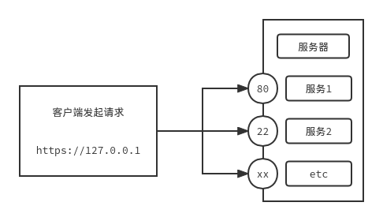

# Nodejs

官网：http://nodejs.cn/

[TOC]

## 安装

`node.js` 在安装时会安装许多内置模块，使用模块需要先导入模块。

### Arch Linux

---

```sh
sudo pacman -S nodejs npm
```

### nvm

---

```sh
# 安装 nvm
curl -o- https://raw.githubusercontent.com/nvm-sh/nvm/v0.39.5/install.sh | bash

# 安装最新版本的node
nvm install node

# 安装指定版本的node
nvm install <version>

# 切换到指定版本
nvm use <version>
```

## http模块

### 客户端与服务器

---

在网络节点中，负责`消费资源`的计算机，称为`客户端`；负责对外`提供网络资源`的计算机，称为`服务器`。

`http`模块用来创建`web服务器`。通过`http.createServer()`方法，就可以把一台普通的计算机变成一台web服务器。

### 域名与域名服务器

---

`ip地址`和`域名`是一一对应的关系。这种对应关系存放在一种叫做`域名服务器(DNS，Domain Name Server)`的计算机中。`域名服务器`就是提供`ip地址`和`域名`之间的转换服务的服务器。

### 端口号

---

在一台电脑中，可以运行成千上万个web服务，每个web服务都对应一个唯一的端口号。客户端发送过来的网络请求，通过端口号，可以被准确地交给`对应的web服务`进行处理。



### 创建基本的web服务器

---

#### 1. 导入http模块

---

```js
const http = require('http')
```

#### 2. 创建web服务器实例

---

调用`http.createServer()`方法，即可创建一个web服务器实例。

```js
const server = http.createServer()
```

#### 3. 为服务器实例绑定requset事件

---

为服务器实例绑定requset事件，即可监听客户端发送过来的网络请求。

```js
server.on('request', (req, res)=>{
    console.log('server created')
})
```

#### 4. 启动服务器

---

调用服务器实例的`listen()`方法，即可启动当前的web服务器实例。

```js
server.listen(post, callback)
```

<++>
