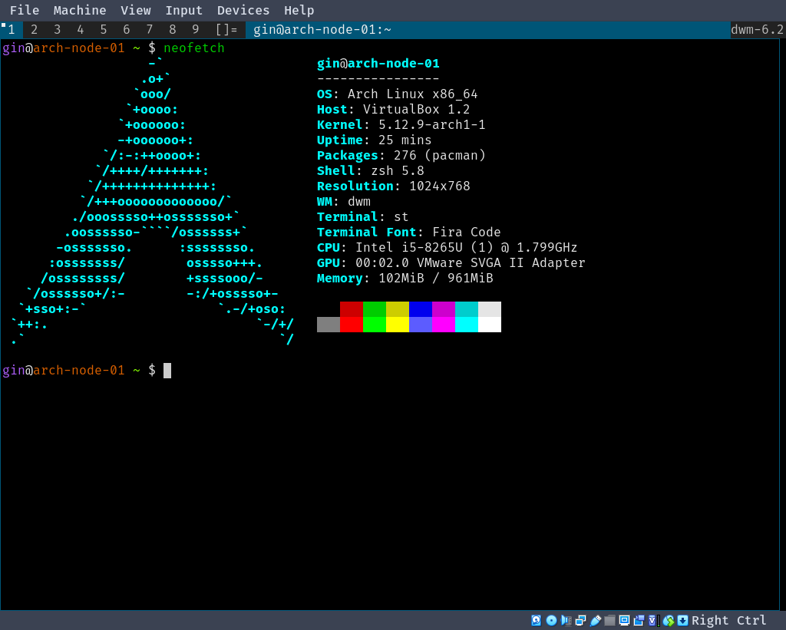
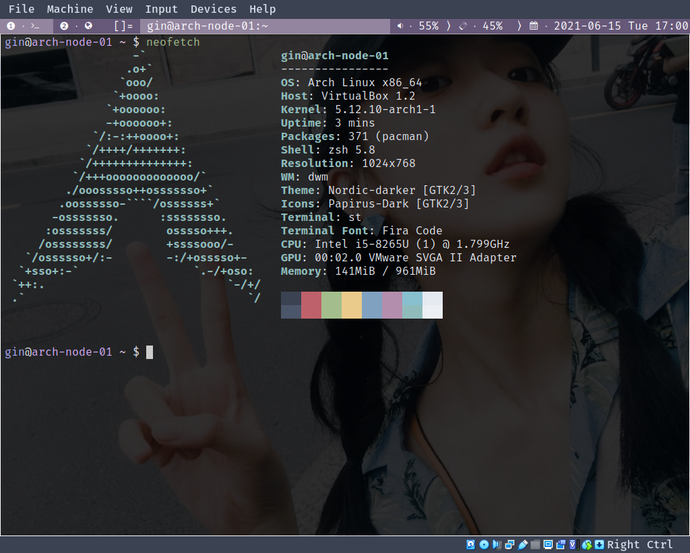
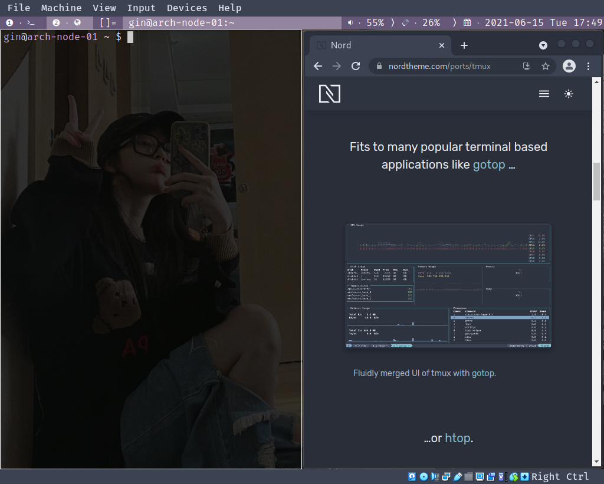

# Arch Linux 美化 (st + dwm)

## 1. 安装 st

文章地址：[Arch Linux 下安装 st (终端模拟器)](https://blog.csdn.net/weixin_44335269/article/details/117848592?spm=1001.2014.3001.5501)

## 2. 安装 dwm

文章地址：[Arch Linux 下安装 dwm (平铺式窗口管理器)](https://blog.csdn.net/weixin_44335269/article/details/117886927?spm=1001.2014.3001.5501)

## 3. 美化

`dwm` 默认样式。



### 壁纸 (feh)

使用 `feh` 可以为系统添加壁纸。

```sh
# 安装 feh
sudo pacman -S feh

# 使用feh添加随机壁纸，Pictures目录下存放壁纸图片。写入`启动脚本`，开机后会自动设置壁纸
feh --bg-fill --no-fehbg -z ~/Pictures/*
```

### 合成管理器 (picom)

使用 `picom` 可以为窗口添加 `透明`，`淡入淡出` 等效果。

```sh
# 安装 picom
sudo pacman -S picom

# `picom -b` 表示将 picom 在后台运行。写入`启动脚本`，开机后会自动启动 picom
picom -b
```

`picom` 的配置文件为：`~/.config/picom/picom.conf`。

### 主题和图标 (gtk & qt)

下载 `主题` 和 `图标`。

```sh
# 下载主题 (nord风格主题)
yay -S nordic-darker-theme

# 下载图标 (papirus图标)
sudo pacman -S papirus-icon-theme
```

#### 设置 gtk 主题和图标

通过 `lxappearance` 可以设置 `gtk` 程序的主题和图标。

```sh
sudo pacman -S lxappearance
```

#### 设置 qt 主题和图标

通过 `qt5ct` 可以设置 `qt` 程序的主题和图标。

```sh
sudo pacman -S qt5ct
```

使用 `qt5ct` 需要在 `~/.xinitrc` 文件中添加一下代码：

```sh
export QT_QPA_PLATFORMTHEME=qt5ct
```

安装 `qt5-styleplugins` 可以将 `qt` 程序设置为 `gtk` 风格。

```sh
yay -S qt5-styleplugins
```

### 美化后效果





